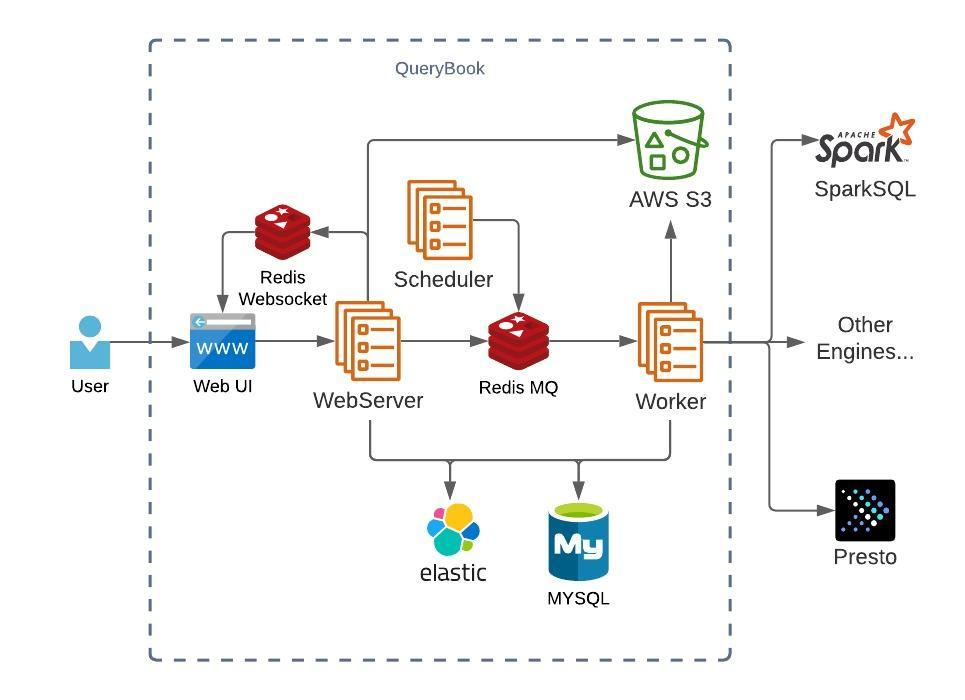

# Querybook 📔

Querybook은 Notebook 인터페이스에 BI요소 및 Catalog 요소 등을 추가한 Big Data IDE로 Pinterest에 의해 개발된 오픈소스입니다.

Querybook의 가장 특별한 Feature에 대해 설명한다면, DataDocs로 구글닥스와 같이 문서형태로 공유가능하며 Query, Text, Chart 등을 추가할 수 있습니다.

Querybook은 Flask 기반이며, 인프라는 다음과 같이 구성되어 있습니다.

**Database**  
Database는 DataDocs나 Query Execution History, User Info등을 담는 장소입니다. 보통 MySQL Pod를 k8s상에 띄워서 사용하거나, 개인의 저장소를 사용할 수도 있습니다. SQLAlchemy가 호환되면 다 가능합니다.

**Redis**  
Redis는 캐싱, worker에 async jobs 보내기 등을 위하여 필요합니다. 보통 Redis Pod을 사용합니다.

**ElasticSearch**  
ElasticSearch는 database에 있는것들에 대한 search/autocomplete function을 제공합니다. k8s상에서 elasticsearch pod를 띄우거나 개인의 ES를 사용할 수 있습니다.

**Remote Storage** 
쿼리 결과를 보관하는 장소입니다. 보통 S3를 따로 지정해서 쓰나, 선언되지 않으면 Database에 저장이 됩니다.

Querybook의 사용 Flow에 대해 짧게 설명한다면:

-  User가 DataDoc에 Query를 작성.
- Webserver에 Socket.IO를 통해 Query 작성을 스트리밍.
- Redis를 통하여 Query 변경 사항을 현재 DataDoc에 접속하고 있는 사람들에게 배포. (이 부분은 구글 닥스 느낌입니다)
- 그 사이 Webserver는 변경된 Query를 Database에 업데이트, 그리고 ElasticSearch에 DataDoc 업데이트를 위한 Worker Async Job을 제작
- 쿼리 구동시, 쿼리 구동 사실을 Database에 삽입, 그리고 Redis queue에 쿼리 구동 job을 놓음.
- Worker가 이를 받아 Query Engine에 전달. (Presto, Hive, Spark 등)
- 또한 Worker는 Socket.IO를 이용해 이 사이에 UI에 업데이트를 함.
- 쿼리가 완료시, Worker는 결과를 받아 Remote Storage에 저장.
- 또한 Webserver는 이 사이 쿼리 결과를 User에게 보여줌

다음은 Querybook에 대한 구체적인 사용법입니다.